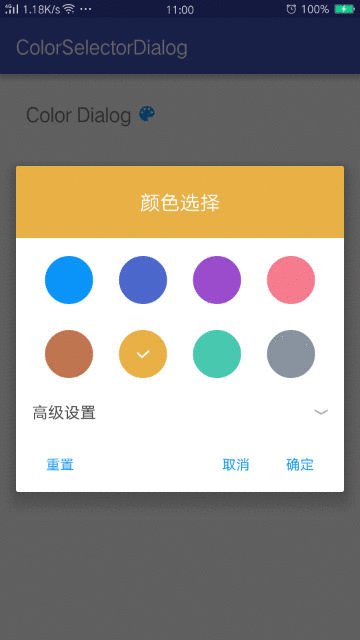

# ColorSelectorDialog
自定义ColorSelector颜色选择对话框
======
## 调用方式简单：
```java
       if (hsvDialog == null) {
            hsvDialog = new HSVDialog(this);
          }

        mStartcolor = CommonUtil.getSharePreenceValue(HsvDialogActivity.this,
                CommonUtil.HSV_DIALOG_COLOR_VALUE_KEY,
                ContextCompat.getColor(HsvDialogActivity.this, R.color.col_primary));
        hsvDialog.setmStartcolor(mStartcolor);//一开始的着色
//        hsvDialog.setmSuffix(mPreference.getmSuffix());//需要单独保存可以添加后缀作为区分。
        hsvDialog.setHsvDialogOnClickInterface(hsvDialogOnClickInterface);//点击事件监听
        AlertDialog alertDialog = hsvDialog.buildDialog();//最后创建对话框
        hueRecyclerAdapter = hsvDialog.getHueRecyclerAdapter();
        alertDialog.show();
```
### 效果：


